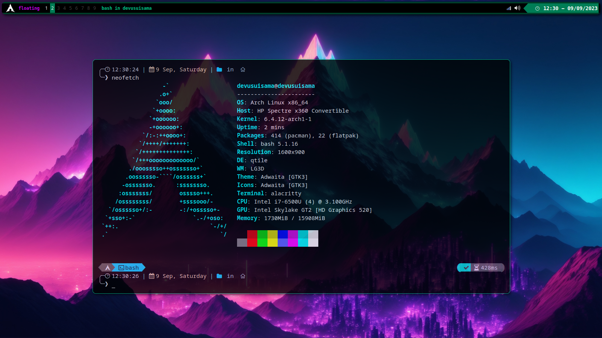

# QTILE CONFIGURACIÓN

## Preview

## Necesarios
| Paquete | Descripción |
|---|---|
| alsa-utils | Sonido |
| picom | Compositor |
| gnome-screenshot | Captura de Pantalla |
| acpilight | Ajuste de Brillo |
| network-manager-applet \| volumeicon | Systray |
| rofi \| rofi-emoji | Iniciador |
| autorandr | Detecta automáticamente el hardware de pantalla conectado y carga la configuración X11 adecuada mediante xrandr |

## Fuentes
| Paquete | Descripción |
|---|---|
| noto-fonts \| noto-fonts-cjk \| noto-fonts-emoji | Google Noto |
| ttf-symbola | Unicode Standard (TTF) |

## Iconos
| Paquete | Descripción |
|---|---|
| papirus-icon-theme | Iconos SVG |

## Extras
| Paquete | Descripción |
|---|---|
| ranger | Gestor de Archivos |
| neofetch | CLI Informacion del Sistema |
| oh-my-posh | Motor de Temas Shell |
| feh | Visualizador de Imagenes |
| pulseaudio | Audio |
| flatpak | Marco de Distribución y Aislamiento de Aplicaciones Linux |

## Autor ✒️
* **Usui, José Fernando** - *Diseño y Configuración*

## Contacto 📱
* Gmail: _joesesilvae@gmail.com_
