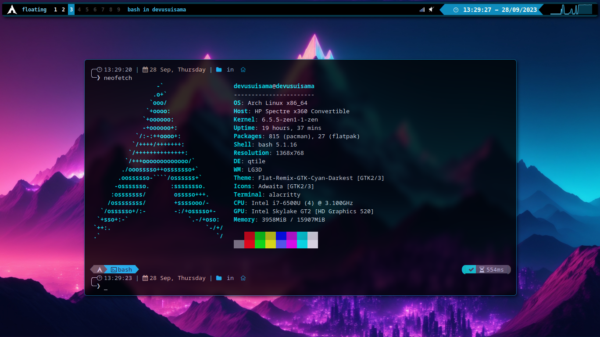

# QTILE CONFIGURACIÓN

## Descripción
La finalidad de este repositorio no es otra que la de guardar y almacenar los diseños y configuraciones realizadas, además de servir como guía para una posterior instalación.

## Preview


## Necesarios
| Paquete | Descripción |
|---|---|
| picom | Compositor |
| gnome-screenshot | Captura de Pantalla |
| acpilight | Ajuste de Brillo |
| network-manager-applet \| volumeicon | Systray |
| rofi \| rofi-emoji | Iniciador |
| libinput \| xf86-input-libinput \| xorg-xinput  | Manejar Dispositivos de Entrada |
| pulseaudio \| pulseaudio-alsa \| pulseaudio-ctl | ``` Video \| Audio \| Micrófono => OBS ``` |

## Fuentes
| Paquete | Descripción |
|---|---|
| noto-fonts \| noto-fonts-cjk \| noto-fonts-emoji | Google Noto |
| ttf-symbola | Unicode Standard (TTF) |

## Iconos
| Paquete | Descripción |
|---|---|
| papirus-icon-theme | Iconos SVG |

## Theme [GTK]
| Paquete | Descripción |
|---|---|
| flat-remix-gtk | Un Conjunto de Theme |

## Extras
| Paquete | Descripción |
|---|---|
| ranger | Gestor de Archivos |
| neofetch | CLI Información del Sistema |
| oh-my-posh | Motor de Temas Shell |
| gnome-eog | Visualizador de Imágenes |
| flatpak | Marco de Distribución y Aislamiento de Aplicaciones Linux |
| pavucontrol | panel de control -> audio |

## Autor ✒️
* **Usui, José Fernando** - *Diseño y Configuración*

## Contacto 📱 
* Gmail: _joesesilvae@gmail.com_
